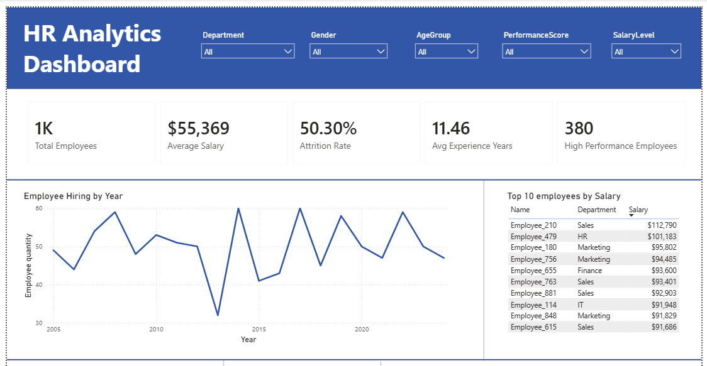
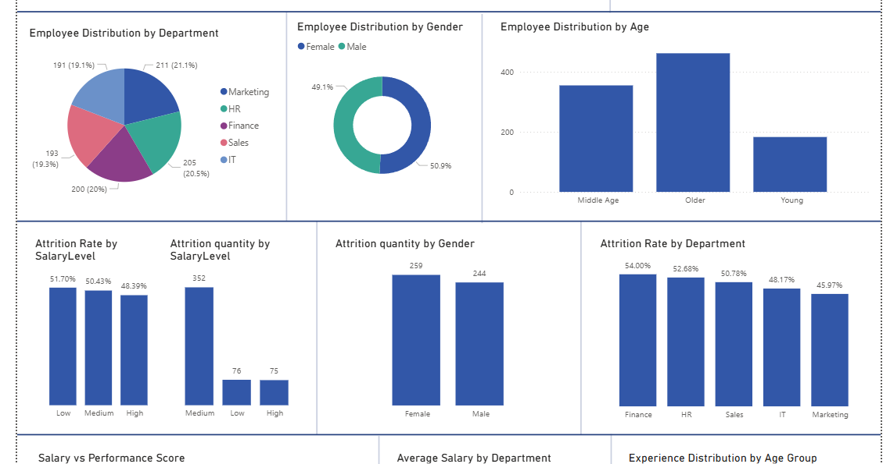
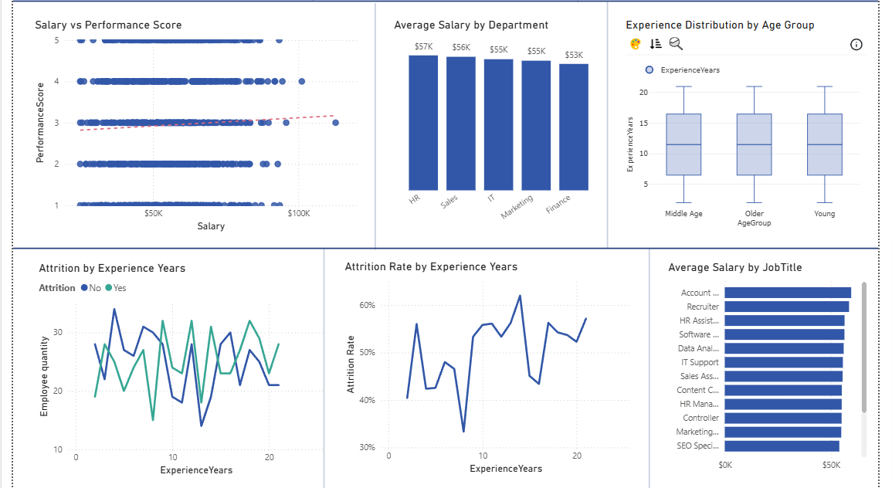

# HR Analytics Dashboard | Power BI

This project presents an HR analytics dashboard built in Power BI using an employee dataset. The goal was to analyze workforce structure, salary distribution, employee performance, attrition patterns, and hiring trends.

## Dashboard Preview







## Project Objectives

The dashboard was designed to answer the following HR business questions:

1. Which department has the highest number of employees?
2. Which department has the highest attrition rate?
3. Which gender is more represented in the company?
4. Which department has the highest average salary?
5. Which department has the lowest average salary?
6. Is there a relationship between salary and performance score?
7. Which age group is the most common?
8. Do younger or more experienced employees leave more often?
9. How has employee hiring changed over time?
10. Which salary level has the highest attrition?

## Dataset

The dataset contains 1,000 employee records with the following fields:

| Column | Description |
|---|---|
| EmployeeID | Unique employee identifier |
| Name | Employee name |
| Gender | Employee gender |
| Age | Employee age |
| Department | Employee department |
| JobTitle | Employee job title |
| HireDate | Date of hiring |
| Salary | Annual salary in USD |
| PerformanceScore | Employee performance score from 1 to 5 |
| Attrition | Whether the employee left the company: Yes / No |

## Data Preparation

The following data preparation steps were completed in Power Query / Power BI:

- Removed duplicates by `EmployeeID`
- Converted `HireDate` to date format
- Created `ExperienceYears` based on years since hire date
- Created `SalaryLevel` categories:
  - Low: below $40,000
  - Medium: $40,000–$70,000
  - High: above $70,000
- Created `AgeGroup` categories:
  - Young: 18–29
  - Middle Age: 30–44
  - Older: 45+

## Key DAX Measures

```DAX
Total Employees = COUNT(employees_data[EmployeeID])

Average Salary = AVERAGE(employees_data[Salary])

Total Attrition =
CALCULATE(
    COUNT(employees_data[EmployeeID]),
    employees_data[Attrition] = "Yes"
)

Attrition Rate =
DIVIDE([Total Attrition], [Total Employees])

Avg Experience Years = AVERAGE(employees_data[ExperienceYears])

High Performance Employees =
CALCULATE(
    COUNT(employees_data[EmployeeID]),
    employees_data[PerformanceScore] >= 4
)

Female % =
DIVIDE(
    CALCULATE(COUNT(employees_data[EmployeeID]), employees_data[Gender] = "Female"),
    [Total Employees]
)
```

## Dashboard Features

The Power BI report includes:

- KPI cards for total employees, average salary, attrition rate, average experience, and high performers
- Slicers for Department, Gender, Age Group, Performance Score, and Salary Level
- Hiring trend line chart by year
- Employee distribution by department, gender, age, and age group
- Salary analysis by department and job title
- Attrition analysis by department, gender, salary level, and experience years
- Scatter plot for Salary vs Performance Score
- Boxplot for experience distribution by age group
- Top 10 employees by salary table

## Key Insights

- The company has 1,000 employees.
- The average salary is approximately $55,369.
- The overall attrition rate is 50.30%.
- Marketing is the largest department with 211 employees.
- Finance has the highest attrition rate at 54.00%.
- HR has the highest average salary at approximately $57K.
- Finance has the lowest average salary at approximately $53K.
- Female employees represent 50.9% of the workforce, while male employees represent 49.1%.
- The most common age group is Older, with 462 employees.
- The relationship between salary and performance score appears weak based on the scatter plot and trend line.
- By count, attrition is highest in the Medium salary group. By attrition rate, the Low salary group has the highest attrition rate.

## Repository Structure

```text
hr-analytics-dashboard/
├── dashboard/
│   └── HR_Analytics_Dashboard.pbix
├── data/
│   └── employees_data.csv
├── docs/
│   ├── Analytical_Report_EN.md
│   ├── Original_Report_RU.docx
│   └── Dashboard_Screenshots.docx
├── screenshots/
│   ├── dashboard_top.png
│   ├── dashboard_middle.png
│   └── dashboard_bottom.png
├── .gitignore
└── README.md
```

## Tools Used

- Power BI
- Power Query
- DAX
- Data visualization
- HR analytics

## How to Open the Project

1. Download or clone this repository.
2. Open `dashboard/HR_Analytics_Dashboard.pbix` in Power BI Desktop.
3. Review the data model, DAX measures, and dashboard visuals.
4. Read the analytical report in `docs/Analytical_Report_EN.md`.

## Author

Alikhan Salimov
