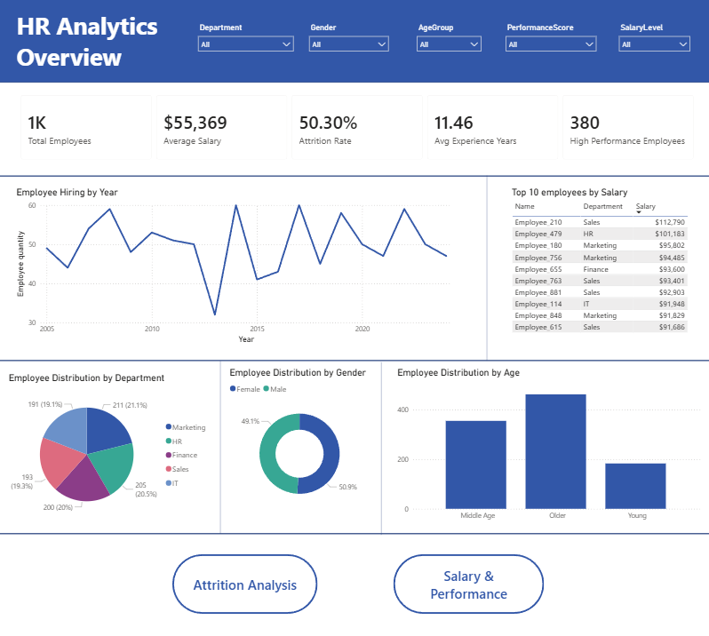
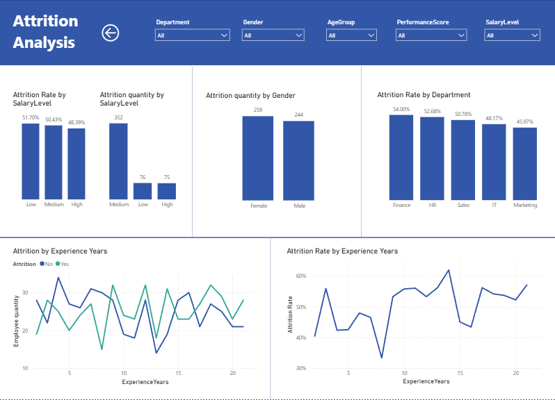
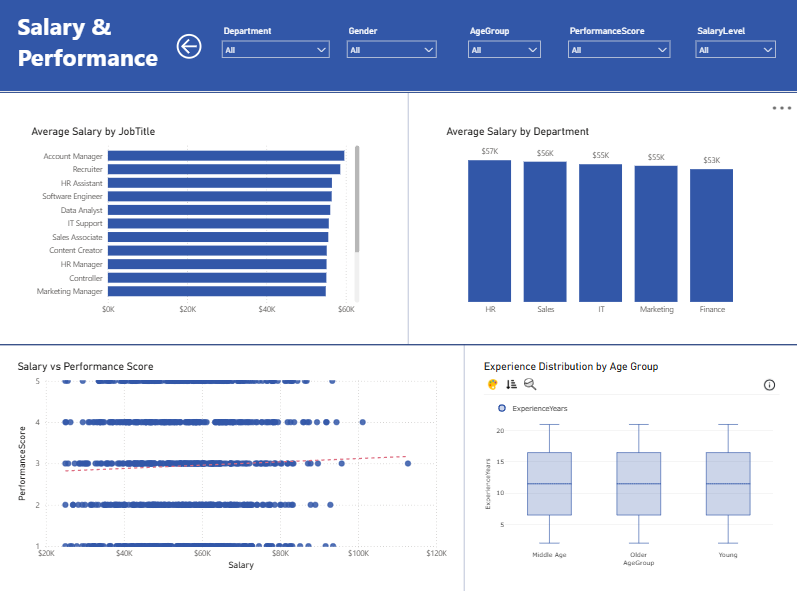

# HR Analytics Dashboard | Power BI

## Project Overview

This project is a multi-page Power BI HR Analytics report designed to analyze employee demographics, salary levels, performance scores, attrition, work experience, and hiring trends.

The report was built using an HR dataset with 1,000 employee records and includes three dedicated report pages:

1. **HR Analytics Overview** — overall workforce profile, KPIs, hiring trend, department, gender, and age group distribution.
2. **Attrition Analysis** — employee attrition by salary level, gender, department, and experience years.
3. **Salary & Performance** — salary patterns by department and job title, salary-performance relationship, and experience distribution by age group.

---

## Tools Used

- **Power BI** — dashboard development and data visualization
- **Power Query** — data cleaning and transformation
- **DAX** — calculated measures and KPI creation
- **Data Modeling** — structured analytical model for HR metrics
- **CSV Dataset** — source employee data

---

## Dataset

The dataset contains employee-level HR information, including:

| Column | Description |
|---|---|
| EmployeeID | Unique employee identifier |
| Name | Employee name |
| Gender | Employee gender |
| Age | Employee age |
| Department | Employee department |
| JobTitle | Employee role/title |
| HireDate | Employee hiring date |
| Salary | Annual salary in USD |
| PerformanceScore | Employee performance rating |
| Attrition | Whether the employee left the company |

---

## Data Preparation

The data was cleaned and transformed in Power Query before building the dashboard.

Main preparation steps:

- Removed duplicate records based on `EmployeeID`
- Converted `HireDate` into Date format
- Created `ExperienceYears` to calculate employee tenure
- Created `SalaryLevel` categories:
  - Low: salary below $40,000
  - Medium: salary between $40,000 and $70,000
  - High: salary above $70,000
- Created `AgeGroup` categories:
  - Young: 18–29
  - Middle Age: 30–44
  - Older: 45+

---

## DAX Measures

The following DAX measures were created to support dashboard analysis:

- `Total Employees`
- `Average Salary`
- `Total Attrition`
- `Attrition Rate`
- `Average Experience Years`
- `High Performance Employees`
- `Average Salary by Performance Score`
- `Female Percentage`

These measures were used to create KPI cards, attrition comparisons, salary analysis, and workforce segmentation.

---

## Dashboard Pages

### 1. HR Analytics Overview

This page provides a high-level summary of the workforce, including key HR KPIs, hiring trends, employee distribution by department, gender, and age group, as well as the top 10 highest-paid employees.



### 2. Attrition Analysis

This page focuses on employee attrition patterns across salary levels, gender, departments, and years of experience. It helps identify which workforce segments show higher retention risk.



### 3. Salary & Performance

This page analyzes salary distribution by job title and department, the relationship between salary and performance score, and experience distribution by age group.



---

## Key Metrics

| Metric | Value |
|---|---:|
| Total Employees | 1,000 |
| Average Salary | $55,369 |
| Attrition Rate | 50.30% |
| Average Experience Years | 11.46 |
| High Performance Employees | 380 |

---

## Key Insights

- The largest department is **Marketing**, with **211 employees** representing **21.1%** of the workforce.
- The highest department-level attrition rate is in **Finance**, at **54.00%**.
- Gender distribution is almost balanced, with **50.9% female** and **49.1% male** employees.
- The highest average salary is in **HR**, at approximately **$57K**.
- The lowest average salary is in **Finance**, at approximately **$53K**.
- The most common age group is **Older (45+)**, with **462 employees**.
- The highest attrition count is in the **Medium** salary group, while the highest attrition rate is in the **Low** salary group.
- The relationship between salary and performance score appears weak, as salaries vary across all performance score levels and the trend line is almost flat.

---

## Repository Structure

```text
powerbi-hr-analytics-dashboard/
│
├── README.md
├── .gitignore
│
├── dashboard/
│   └── HR_Analytics_Dashboard.pbix
│
├── data/
│   └── employees_data.csv
│
├── screenshots/
│   ├── 01_hr_analytics_overview.png
│   ├── 02_attrition_analysis.png
│   └── 03_salary_performance.png
│
└── docs/
    ├── Original_Report_RU.docx
    └── claude_report_prompt.md
```

---

## How to Open the Project

1. Download or clone this repository.
2. Open `dashboard/HR_Analytics_Dashboard.pbix` in Power BI Desktop.
3. Review the three report pages:
   - HR Analytics Overview
   - Attrition Analysis
   - Salary & Performance
4. Use slicers to filter the dashboard by department, gender, age group, performance score, and salary level.

---

## Project Summary

This project demonstrates the use of Power BI for HR analytics and business intelligence reporting. It combines data cleaning, DAX measure creation, interactive visualization, and analytical storytelling to support workforce-related decision-making.
